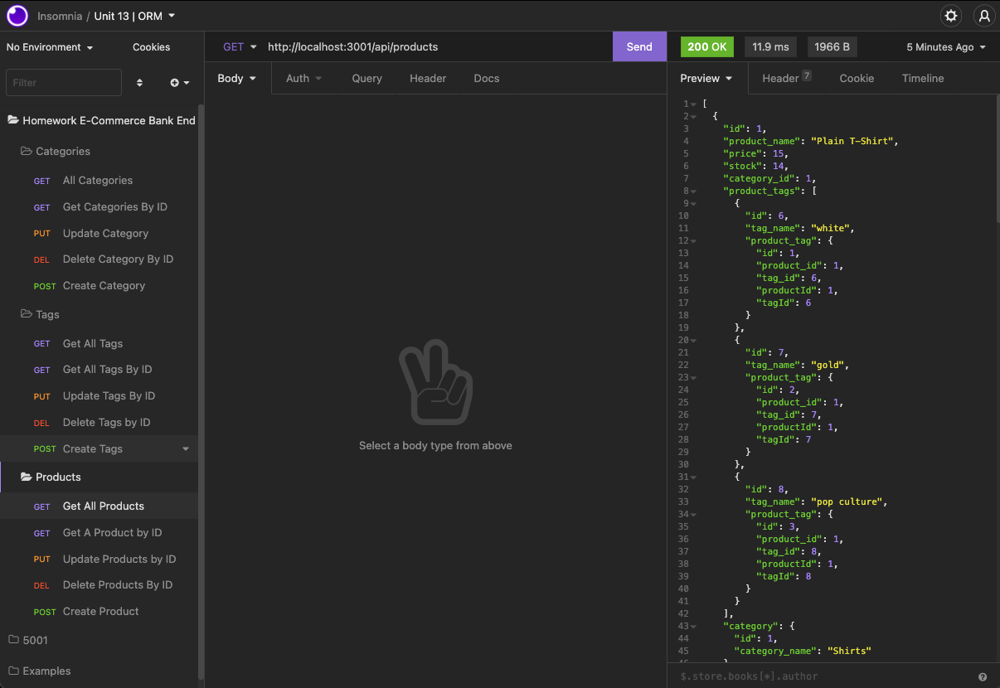

# Chapter 13: Ecom_Backend_yw
by: Yonas Woldemichael

## Table of Contents
- [Description](#description)
- [Installation](#installation)
- [Visuals](#visuals)
- [Usage](#usage)

## Description
In this assignment I tasked to build the back end for an e-commerce site by modifying starter code. You’ll configure a working Express.js API to use Sequelize to interact with a MySQL database.

## Notes
1. This assignment allows you to POST, GET, PUT, and DELETE
2. A wonderful way to learn ORM
3. I have also attached a screenshot of how my insomnia application was structred
4. Thank You.

## User Story

```md
AS A manager at an internet retail company
I WANT a back end for my e-commerce website that uses the latest technologies
SO THAT my company can compete with other e-commerce companies
```
## Installation
The Technology/engine required to run this application/assignment was Sequelize.

## Visuals
This is what my Insomia Application looked like once the assignment was complete.



Attached to this submittion should be the link to a google drive containing a video that demo's the entire app and its functionality

## Usage 

This ORM Assignment allowed me to gain some knowledge on how to use Sequelize.

[Link to Repository](https://github.com/Ybyonas1/ecom_backend_yw)
